# 📦 Supply Chain Optimization — DataCo Global

> **End-to-end supply chain analytics system built on 180K+ real orders across 5 global markets — combining Delivery Risk Prediction, Profitability Analysis, and Demand Forecasting to identify $13.7M in optimization opportunities.**


---

## 🧠 The Business Problem

A global retail company operating across 5 markets — Europe, LATAM, Pacific Asia, USCA, and Africa — with $36.8M in annual revenue and 10.8% overall margin faces three critical supply chain challenges:

- **54.8% of orders arrive late** — over 98,000 deliveries per year fail to meet the scheduled date, with no predictive mechanism to flag at-risk shipments before they leave the warehouse
- **18.7% of orders are loss-making** — nearly 1 in 5 orders destroys margin, with $3.9M in total losses across the dataset period
- **No demand visibility** — inventory decisions are reactive, creating stockout risk estimated at $51,610/month across top categories

> *With a 10.8% margin, every percentage point of operational inefficiency has an outsized impact on profitability.*

---

## ✅ The Solution

A three-component analytics system that transforms raw transactional data into actionable operational intelligence:

- **Delivery Risk Prediction** — Random Forest model that flags at-risk shipments before departure, enabling proactive intervention
- **Profitability & Loss Analysis** — Category-level margin intelligence with strategic classification and optimization recommendations
- **Demand Forecasting & Inventory Optimization** — Prophet-based time series forecasting with safety stock and reorder point calculations per category

---

## 📐 Architecture Overview

```
┌─────────────────────────┐    ┌────────────────────────┐    ┌─────────────────────┐
│   DataCo Dataset        │───▶│   Python Pipeline      │───▶│     MySQL DB        │
│   180K+ orders          │    │   EDA · ML · Forecast  │    │   12 tables         │
│   5 global markets      │    │   RF · XGBoost         │    │   results · metrics │
│   53 features           │    │   Prophet · Stats      │    │   summaries         │
└─────────────────────────┘    └────────────────────────┘    └──────────┬──────────┘
                                                                         │
                                              ┌──────────────────────────▼──────────────────────┐
                                              │            Tableau Dashboard                     │
                                              │   KPIs · Late Delivery · Profitability · Forecast│
                                              └─────────────────────────────────────────────────┘
```

---

## 📊 Interactive Dashboard

> Built in Tableau Public — KPIs, late delivery analysis, profitability by category and market, and demand forecast in a single executive view.

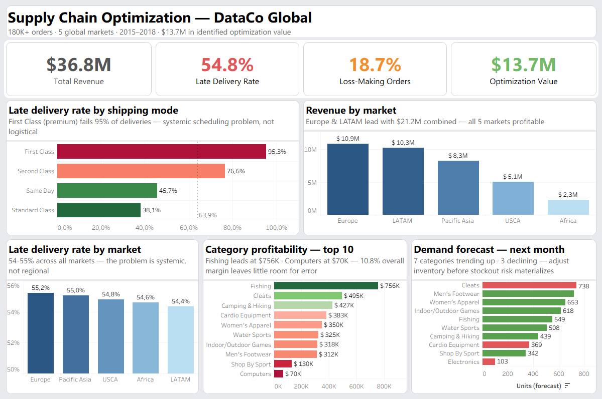

**[→ View live on Tableau Public](https://public.tableau.com/app/profile/andres.navarro77)**

---

## 🔄 Pipeline — Step by Step

| Step | Action | Technology | Business Value |
|---|---|---|---|
| 1 | Load, clean and engineer 180K orders | Python · pandas | Unified operational view |
| 2 | EDA: late delivery patterns, market performance, shipping modes | Python · seaborn | Identify 54.8% late delivery problem |
| 3 | Profitability analysis by category, market, discount level | Python · pandas | Locate $3.9M in losses |
| 4 | Delivery risk prediction — LR · RF · XGBoost | scikit-learn · XGBoost | AUC-ROC 0.743 · $9.2M net benefit |
| 5 | Threshold optimization — maximize recall | scikit-learn | 69.6% recall · 69% precision |
| 6 | Category profitability matrix — strategic classification | Python · pandas | Star · Solid · Underperformer segmentation |
| 7 | Demand forecasting — Prophet (10 categories, 6-month horizon) | Prophet | MAPE 3.2% · actionable inventory signals |
| 8 | Safety stock & reorder point optimization | Python · numpy | $51,610/month stockout risk quantified |
| 9 | ETL to MySQL — 12 production tables | MySQL · SQLAlchemy | Structured data model for BI layer |

---

## 📊 Key Results

| Metric | Value |
|---|---|
| Total orders analyzed | 180,511 |
| Markets covered | 5 (Europe · LATAM · Pacific Asia · USCA · Africa) |
| Late delivery rate | **54.8%** |
| Delivery Risk Model AUC-ROC | **0.743** |
| Recall (late deliveries detected) | **69.6%** |
| Loss-making order rate | **18.7%** |
| Forecast MAPE | **3.2%** (benchmark <10%) |
| **Total identified value** | **$13,723,427** |

---

## 🤖 Delivery Risk Model

| Model | AUC-ROC | Notes |
|---|---|---|
| Logistic Regression | 0.727 | Baseline |
| XGBoost | 0.740 | Strong performer |
| **Random Forest** | **0.743** | **Selected — best AUC** |

**Key finding:** `Days for shipment (scheduled)` and `Shipping Mode` account for ~85% of feature importance — the late delivery problem is systemic, not category or market-specific. First Class shipping has a 95.3% late delivery rate despite being the premium tier.

**Threshold optimization:** Default threshold of 0.5 → optimized to 0.40, improving recall from 57% to 69.6% at the cost of acceptable precision reduction (82% → 69%).

---

## 💡 Business Impact

| Opportunity | Impact |
|---|---|
| Delivery risk model — net benefit | **$9,220,624 / year** |
| Loss-making order recovery | **$3,883,483** |
| Stockout risk avoided (inventory optimization) | **$619,320 / year** |
| **Total identified value** | **$13,723,427** |

*Delivery model assumptions: $25 cost per undetected late delivery · $15 savings per flagged delivery · $3 cost per false alert*

---

## 🔍 Key Findings

| Finding | Business Implication |
|---|---|
| First Class shipping: 95.3% late rate | Premium service fails almost always — pricing vs. SLA mismatch |
| Late delivery is uniform across all markets and categories | Systemic scheduling problem, not logistical |
| Avg delay: 0.57 days | Scheduled days are miscalibrated — small fix, large impact |
| 18.7% loss-making orders across all order statuses | Structural margin issue, not operational |
| Discount rate does not correlate with margin loss | Losses driven by product mix and shipping costs, not discounts |
| Fishing category: MAPE 2.0%, trending up | Highest forecast confidence — increase inventory |
| Electronics: highest MAPE (4.6%), trending down | Reduce stock, monitor closely |
| $51,610/month stockout risk across top 10 categories | Inventory optimization directly reduces revenue leakage |

---

## 📊 Visualizations

**Business Overview**
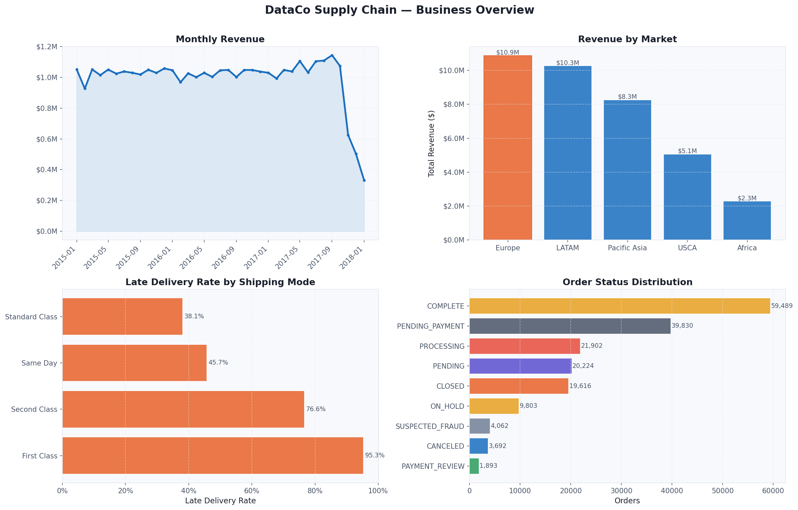

**Late Delivery Analysis**
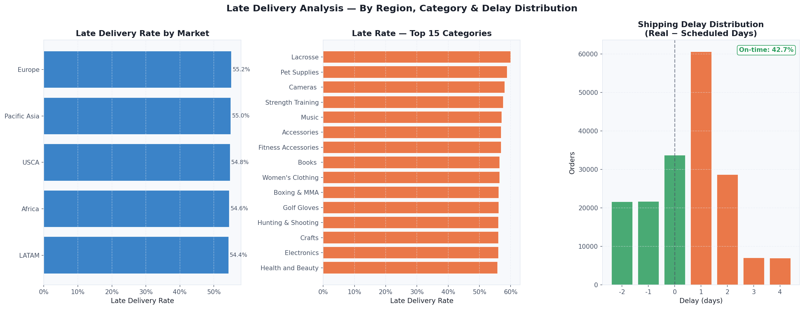

**Profitability Analysis**
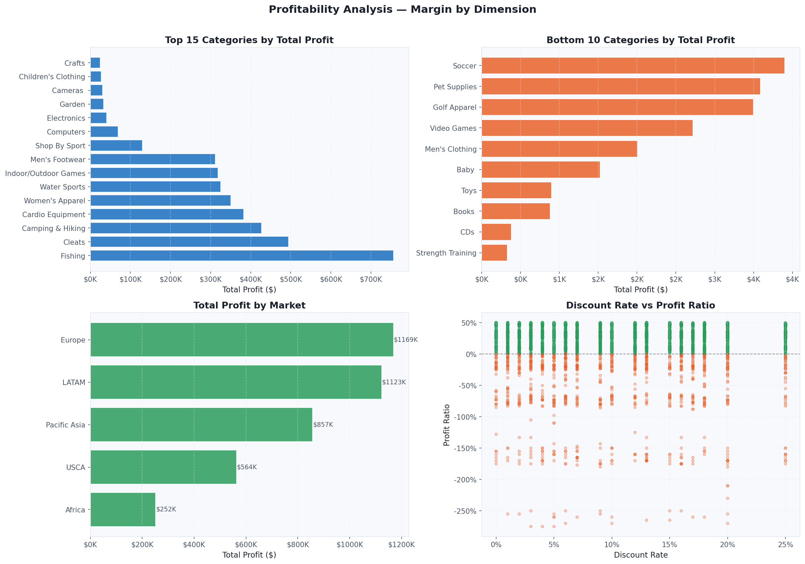

**Category Profitability Matrix**
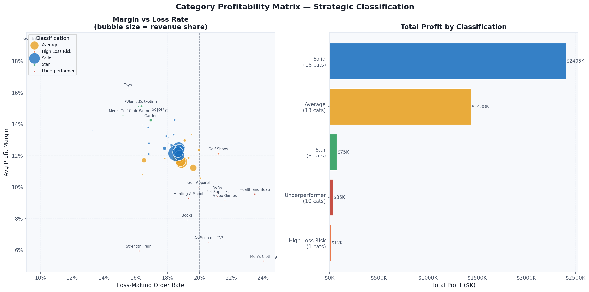

**Delivery Risk Model — Evaluation**
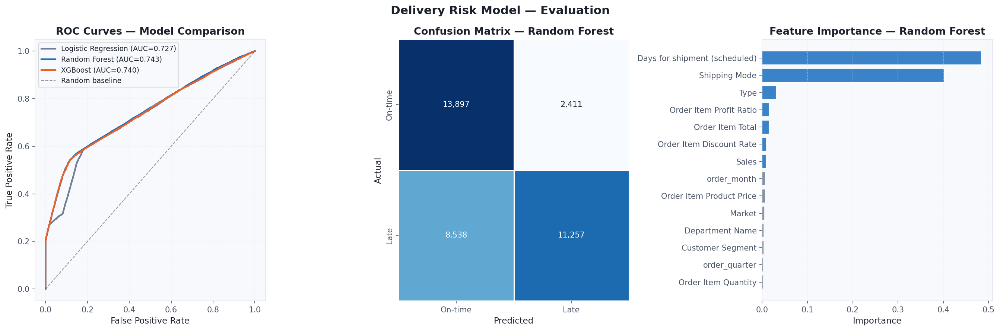

**Threshold Optimization**
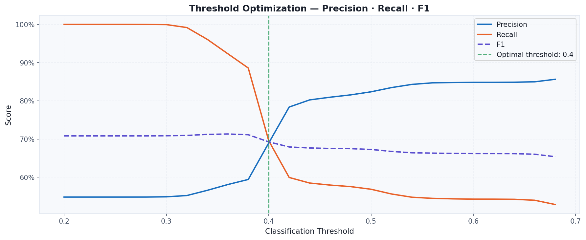

**Delivery Risk — Business Impact**
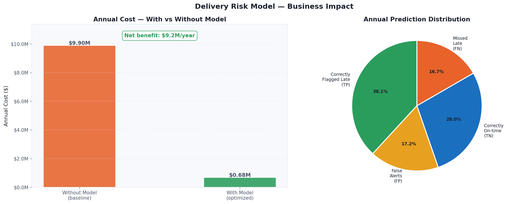

**Discount Impact Analysis**
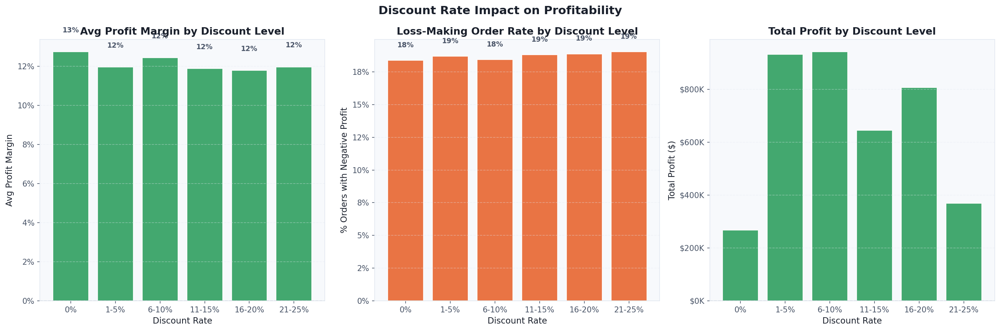

**Loss-Making Orders Analysis**
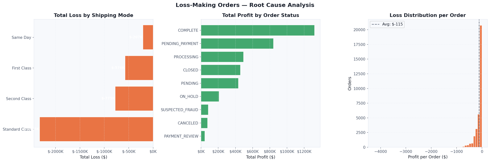

**Demand Forecast — 10 Categories**
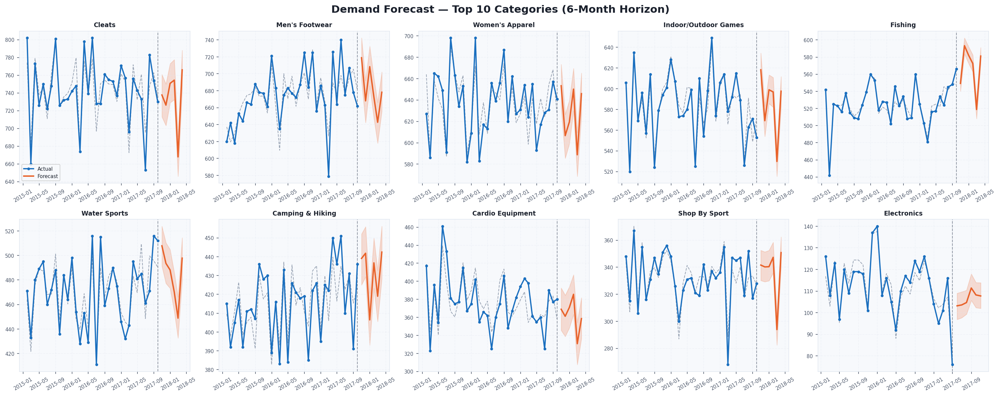

**Inventory Optimization**
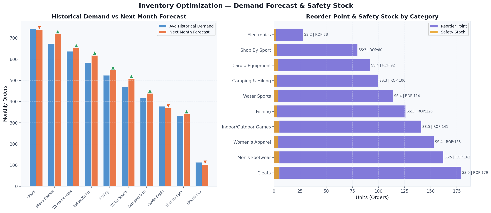

---

## 🛠️ Tech Stack

| Layer | Technology | Purpose |
|---|---|---|
| Data Engineering | Python · pandas · numpy | ETL, feature engineering, cleaning |
| Machine Learning | scikit-learn · XGBoost | Delivery risk classification |
| Time Series | Prophet | Demand forecasting |
| Statistical Analysis | scipy · numpy | Inventory optimization calculations |
| Database | MySQL · SQLAlchemy | 12-table production data model |
| Visualization | matplotlib · seaborn | Analysis charts · model evaluation |
| Dashboard | Tableau Public | Interactive executive dashboard |

---

## 📁 Repository Structure

```
supply-chain-optimization/
│
├── notebooks/
│   ├── 01_eda_and_business_intelligence.ipynb   # EDA · market · late delivery · profitability
│   ├── 02_delivery_risk_prediction.ipynb         # RF · XGBoost · threshold optimization
│   ├── 03_profitability_analysis.ipynb           # Margin · losses · category matrix
│   └── 04_demand_forecasting.ipynb               # Prophet · safety stock · reorder point
├── dashboard/
│   └── supply_chain_dashboard.twb                # Tableau workbook
├── scripts/
│   └── load_to_mysql.py                          # ETL: results → MySQL (12 tables)
├── data/
│   └── processed/                                # Pipeline artifacts (not tracked)
├── img/                                          # Visualization exports (11 charts + dashboard)
├── .env.example
├── .gitignore
├── requirements.txt
└── README_ES.md
```

---

## 📊 Dataset

**DataCo Smart Supply Chain for Big Data Analysis** — available on [Kaggle](https://www.kaggle.com/datasets/shashwatwork/dataco-smart-supply-chain-for-big-data-analysis).

Real commercial supply chain data with 180K+ orders, 53 features covering orders, products, customers, shipping, and financials across 5 global markets (2015–2018).

---

## 🔗 Related Projects

- [fraud-detection](https://github.com/AndyNavarro77/fraud-detection) — XGBoost fraud detection · 97% recall · $55K net benefit
- [customer-analytics](https://github.com/AndyNavarro77/customer-analytics) — RFM · CLV · Cohort Analysis · $1.1M opportunities
- [next-best-offer](https://github.com/AndyNavarro77/next-best-offer) — Hybrid recommendation engine · 88% Precision@3 · $1.6M revenue uplift

---

## 👤 Author

**Andrés Navarro** — Data Analyst · BI · Machine Learning

[](https://github.com/AndyNavarro77)
[](https://www.linkedin.com/in/andrés-navarro77/)
[](https://andres-navarro-portafolio.netlify.app)

---

*Built to demonstrate end-to-end supply chain analytics — from raw transactional data to a production-ready optimization system with $13.7M in quantified business value. Aligned with real-world consulting engagements in Supply Chain & Operations.*